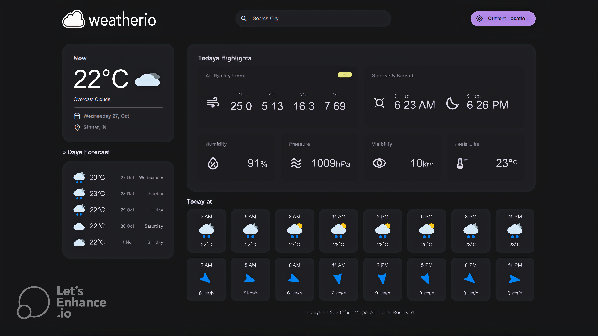

# Weatherio - Weather website

# Hi, I'm Yash Varpe! 👋

## 🔗 [Weatherio](https://yashvarpe05.github.io/Weatherio/)


Weatherio is a weather app that allows you to check the current weather and forecast for various locations. It provides real-time weather information, including temperature, air quality index, humidity, and more.



## About

Weatherio is a web-based weather application built with HTML, CSS, and JavaScript. It uses the OpenWeatherMap API to fetch weather data for different locations. This app is designed to be simple and user-friendly, providing essential weather information at a glance.

## Features

- Current weather display with temperature, description, and location.
- Air quality index (AQI) information.
- Sunrise and sunset times.
- Hourly and 5-day weather forecasts.
- Search for weather information by city name.
- Option to use the current location.

## Getting Started

To get started with Weatherio, follow these steps:

1. Clone the repository to your local machine:

   ```bash
   git clone          https://github.com/YashVarpe05/Weatherio.git
   ```

2. Go to the project directory

   ```bash
   cd Weatherio
   ```

## Authors

- [@yashvarpe05](https://www.github.com/YashVarpe05)

## 🚀 About Me

[](https://www.linkedin.com/in/yash-varpe-960703234/)

## License

[MIT](https://choosealicense.com/licenses/mit/)
